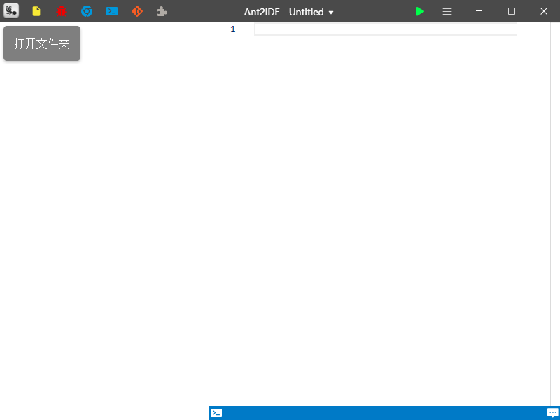

# AntIDE_open
> 取名含义是一个轻量级但功能又很强大的IDE，同时也暗示 anti develope environment，即反集成开发环境，告诫使用者不能把它用于开发商业软件程序，只能用来做题。。。

**顺手点一下右上角star，真的很重要的呀！！谢谢**

如果下载比较慢的话，建议加一下这个QQ群：897639646，最新版本会同步更新在群里，也欢迎大家在群里提交bug或者发表idea。

## 预期特点
1. 多种风格
2. 图标是一个蚂蚁的图标（暂定）
3. Git存储代码
4. 代码打击声效
5. 文字排版系统
6. 柔和光标
7. 半透明状的动态Run键
8. CTRL+点击函数名字转到声明
9. 无文件夹编译，多编程语言支持
0. 右键菜单有浏览器搜索，可通过内置浏览器快速浏览相关代码，函数定义，或者出题网站的题目
1. 具有丰富动画效果，具有google的material设计，intellij设计，windows设计， 纯色设计
2. 强大的文件管理系统，在文件浏览框里直接进行浏览打开文件，有搜索文件框
3. 高性能的快捷键
4. 自动添加修改声明，同时有一个小窗口显示所有函数
5. 要进行文本编辑具有一个菜单栏，就像wps或者msoffice一样
6. 能够插入图片，表格，图片框，文本框，流程图作为注释
7. 文档模板创建系统，snipper
8. 自定义颜色背景
9. Github系统能够传送到云端
0. 代码运行到哪里用线表示而不是用颜色段来表示
1. 耗时强度，从绿色到红色，可以快速看出那些地方耗时严重
2. Debug指针直接变成数组，不再有监视窗口
3. 实时修改代码执行
4. 调试代码回滚
5. 每个变量的每个时期的值都不同

## 开发日志

### 2019/10/1
增加黑暗模式，另外国庆节快乐！

### 2019/9/23
整体重构

### 2019/8/16
解决拖动bug

### 2019/7/24
美化控制台输出，控制台可以接收输入
